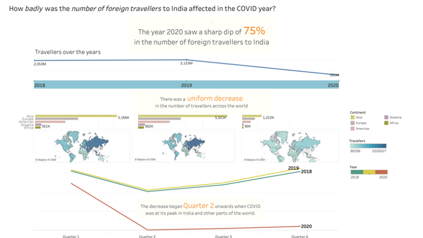

# vacation

We know that the COVID adversely impacted the number of people travelling - within their own country and to other countries. How bad was this impact? Coming from India, I specifically looked at the number of foreign travellers to India during the COVID year.

This was my [submission](https://community.storytellingwithdata.com/challenges/aug-2022-visualize-vacation/how-badly-was-the-number-of-foreign-travellers-to-) to the Storytelling with Data's [visualize vacation August 2022 challenge](https://community.storytellingwithdata.com/challenges/aug-2022-visualize-vacation#accept-challenge) I used Tableau and datasets from [data.gov in](https://data.gov.in/catalogs?sector=Travel%20and%20Tourism) site

